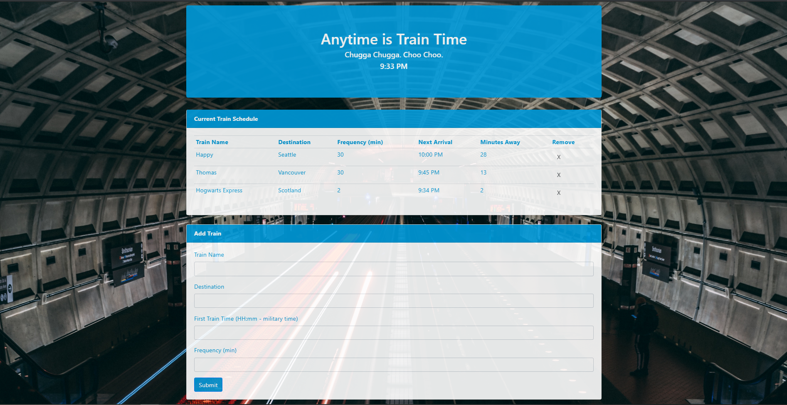

# TrainScheduler

https://w3fl3x.github.io/TrainScheduler/

## Description

Accepts user input to add new train name, start time and frequency to schedule. Displays schedule in repeating table with next arrival based on current time and frequency of train stops. Stores train info in Firebase for data persistence and retrieves information from database on load. Schedule refresh every minute to reflect updated arrival information. User can delete train information from schedule and database by clicking the x to remove it from the schedule.

## Screenshots

### TrainScheduler home page

## Technologies Used

* `Javascript`
* `jQuery`
* `HTML`
* `CSS`
* `Firebase`
* `Moment.js`
